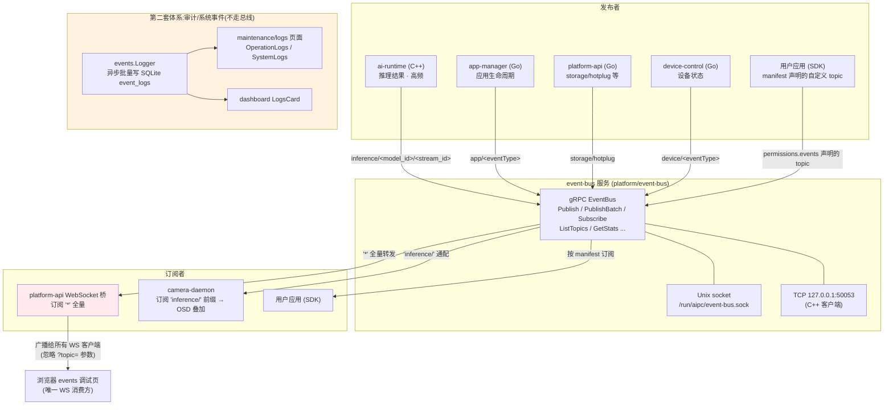

# Event-Bus 架构审查报告

> 审查日期:2026-08-28
> 审查范围:`platform/event-bus`、各服务的事件发布/订阅接入、platform-api 的 Web 事件通路、web 前端事件消费
> 审查方式:代码实测(所有断言附 `文件:行号`),非文档推演
> 配套文档:[事件中心 Web 设计方案](./event-center-web-design.md)

---

## 1. 总体结论

event-bus 的**核心定位是对的**:面向单机边缘设备的轻量纯内存 gRPC pub/sub,零外部依赖、低延迟、支持 MQTT 风格通配符,服务于"设备内进程间实时事件分发"这一场景。**不建议**引入 NATS/MQTT/Redis 等外部 broker 替代它。

当前的主要问题不在总线本体,而在**外围三个环节**:

1. **Web 通路是全量广播**:platform-api 的 WebSocket 桥以 `*` 订阅所有事件并广播给每一个浏览器客户端,高频推理事件(实测 42-47 FPS 检测结果)会直接打爆浏览器。
2. **两套事件体系割裂**:实时总线(不持久)与结构化审计日志 `event_logs`(SQLite,不走总线)互不相通,导致审计事件无法实时推送到浏览器,页面只能靠轮询刷新。
3. **承诺与实现脱节**:proto 字段、`event-bus.yaml` 配置、官方文档 `docs/services/event-bus.md` 宣称的大量特性(持久化、限流、优先级路由、ACL、metrics 端口、性能数据)均未实现,给使用者造成错误预期。

---

## 2. 实测架构

### 2.1 架构图(实测)

**要点**:
- 右侧的审计体系与总线**完全平行**——`events.Logger` 由各 handler 直接函数调用写入,不经过 event-bus,因此浏览器 WebSocket 收不到任何审计事件(登录、应用安装、配置变更等)。
- 唯一的"双写"范例是 storage 事件:`NewStorageHandlers` 同时拿到总线发布函数和事件日志器(`platform/platform-api/server/main.go:859` 附近)。

### 2.2 总线本体(`platform/event-bus/server/main.go`)

| 方面 | 实测结论 | 证据 |
|---|---|---|
| 服务形态 | Go gRPC,双监听:Unix socket(容器可经组权限接入)+ TCP 回环(C++ 客户端无 unix: resolver) | `main.go:474-503` |
| RPC 接口 | Publish / PublishBatch(客户端流式)/ Subscribe(服务端流式)/ Unsubscribe / ListTopics / GetTopicInfo / GetStats / GetTopicStats | `proto/event.proto:93-113` |
| 匹配 | MQTT 风格通配符 `*`(单层)/ `**`(多层)/ `**/suffix` + metadata 键值等值过滤 | `main.go:139-154, 394-398` |
| 投递 | fire-and-forget:每订阅者一个 `chan *pb.Event`(容量取 `bus.queue_size`,默认 1000),**队列满时丢弃新消息** | `main.go:156-164, 194` |
| 持久化 | **无**。config 中 `persist_enabled` 字段被解析但无任何使用 | `main.go:40-44` vs 全文 |
| 统计 | 每 topic 的 published/delivered/dropped 原子计数 + 最近消息时间;`avg_latency_us` 恒为 0 | `main.go:319-347` |
| 事件 ID | 未提供时生成 `evt-<unixmilli>-<seq>` | `main.go:108-114` |

### 2.3 发布/订阅拓扑表(实测)

| 发布者 | Topic | 频率量级 | 证据 |
|---|---|---|---|
| ai-runtime | `inference/<stream_id>`(自动推理流) | 每帧,实测 42-47 FPS | `platform/ai-runtime/src/auto_infer.cpp:523` |
| ai-runtime | `inference/<model_id>/<stream_id>`(默认前缀 `inference/`,可配) | 每帧 | `auto_infer.cpp:573`、`include/config.h:61` |
| app-manager | `app/app.installed` / `app.app.started` 等(见 P7 命名瑕疵) | 低频 | `platform/app-manager/server/server.go:334`(`topic := "app/" + eventType`)+ `configs/platform/app-manager.yaml:114-120` |
| platform-api | `storage/hotplug` | 极低频 | `platform/platform-api/handlers/disk.go:343` |
| device-control | `device/gpio_change` / `device/temperature_alert` / `device/day_night_switch` / `device/ptz_preset_reached` | 低频 | `platform/device-control/server/main.go:228` + `configs/platform/device-control.yaml:88-93` |
| 用户应用 | manifest `permissions.events.publish` 声明 | 应用自定 | `platform/app-manager/manifest/manifest.go:110, 122-125` |

| 订阅者 | 订阅 Topic | 用途 | 证据 |
|---|---|---|---|
| platform-api WS 桥 | `*`(全量) | 转发浏览器 | `platform/platform-api/server/main.go:835` |
| camera-daemon | `inference/` 前缀 | AI 检测框叠加到视频 OSD | `platform/camera-daemon/include/ai_overlay_subscriber.h:29` |
| 用户应用 | manifest `permissions.events.subscribe` | 应用消费事件 | `manifest.go:110` |

**命名瑕疵**:app-manager 的 eventType 本身已含 `app.` 前缀(如 `app.installed`),再拼接 `app/` 前缀后 topic 变成 `app/app.installed`——语义重复,建议统一为 `app.installed` 或 `app/installed` 二选一(见 P7)。

### 2.4 Web 事件通路现状

| 通路 | 端点 | 现状 |
|---|---|---|
| REST | `GET /api/v1/events/topics`、`POST /api/v1/events/publish` | `platform-api/server/main.go:586-588` |
| WebSocket | `GET /api/v1/events/stream` | 单一 `*` 订阅 + 全量广播(`main.go:835`、`websocket/events.go:53-69`) |
| REST(审计) | `/api/v1/event-logs`(list / statistics / templates / cleanup / create) | `main.go:591-597`,数据源 SQLite `event_logs` |

前端消费方(`web/`):

| 位置 | 机制 | 证据 |
|---|---|---|
| events 页(隐藏,不在菜单) | WebSocket 调试台:TopicList / SubscriptionPanel / PublishForm / EventStream | `web/src/pages/events/index.tsx`、路由 `web/src/router/index.tsx:59`;`web/src/layout/pc/menu.tsx` 无 events 菜单项 |
| dashboard | 2-5s 轮询(`refetchInterval`) | `web/src/services/dashboard.ts` |
| apps 列表 | 轮询 | `web/src/pages/apps/index.tsx` |
| maintenance/logs | REST 分页查询 event_logs | `web/src/pages/maintenance/logs/` |

---

## 3. 问题清单(分级)

### P1【High】WebSocket 桥全量广播,忽略 `?topic=` 订阅参数

**证据**:
- 前端构造 WS URL 时带上了订阅参数:`web/src/services/api/events.ts:12-19`(`?topic=a&topic=b`)
- 后端 `HandleWebSocket` 从不读取查询参数,注册后只收广播:`platform/platform-api/websocket/events.go:53-69`
- 桥对 event-bus 的订阅是固定 `*`:`platform/platform-api/server/main.go:835`(`go s.eventStream.Start(ctx, "*")`)
- 广播函数把每条事件发给所有客户端,客户端缓冲满则丢:`websocket/events.go:119-131`

**影响**:
- 每个浏览器都接收全部事件流,包括 `inference/*` 高频事件(设备实测 42-47 FPS)。事件中心一旦产品化、多标签页打开,带宽与 CPU 将被推理事件占满,低频重要事件反而可能被挤掉(客户端发送缓冲满即丢)。
- 前端 `useEventStream` 在 `onmessage` 中**不过滤** topic(`web/src/hooks/useEvents.ts:95-119`),所谓"订阅"只是 UI 状态,线路层面没有约束。

**建议**:WS 升级为按客户端订阅协议(首帧 `{"action":"subscribe","topics":[...]}`,服务端为每个客户端维护订阅集),默认订阅集排除 `inference/*`;详见设计方案 §4.1。

### P2【High】两套事件体系割裂,审计事件无实时通路

**证据**:
- 审计/系统事件由 `events.Logger` 直接写 SQLite(`platform/common/events/logger.go:31-47, 126-178`),不经过 event-bus;
- WS 桥只转发总线事件,浏览器因此收不到登录、应用安装/启停、配置变更、固件升级等审计事件的实时推送;
- `maintenance/logs` 与 dashboard LogsCard 只能靠手动刷新/轮询拿新数据。

**影响**:"事件中心"缺了最有产品价值的一半——对用户可读、可追溯的审计事件恰恰是低频高价值、天然适合推送的内容;而总线里最活跃的反而是机器消费的推理结果。

**建议**:在 `events.Logger` 落库的同时双写总线(topic 建议 `audit/<event_type>`,metadata 携带 level/category/user),storage 事件已有等价范例;WS 默认订阅集包含 `audit/*`。详见设计方案 §4.2。

### P3【Medium】proto 字段与配置项大量"声明未实现"

**证据**(逐项):

| 承诺 | 位置 | 实现状态 |
|---|---|---|
| `PublishRequest.persistent` / `ttl_ms` | `proto/event.proto:52-53` | 服务端未读取,`main.go:91-93` 只取 `req.Event` |
| `SubscribeRequest.queue_size` / `drop_old` | `proto/event.proto:42-43` | 未读取;队列容量一律取服务端 config(`main.go:194`),且满时丢**新**消息,与 `drop_old`(丢旧)语义相反 |
| `bus.workers` / `batch_size` / `inactive_topic_ttl` | `configs/platform/event-bus.yaml:22-26` | Config 结构体只解析 `queue_size`/`max_topics`/`persist_enabled`,其余字段无定义(`main.go:40-44`) |
| `bus.max_topics` | `event-bus.yaml` | 已解析但服务端无上限 enforcement |
| `routing.priorities` / `rate_limits` | `event-bus.yaml:28-40` | 无对应代码 |
| `monitoring.stats_interval_sec` / `metrics_port: 9091` | `event-bus.yaml:42-46` | 无 Prometheus/指标端点 |
| `security.auth_enabled` / `acl_enabled` / `acl_file` | `event-bus.yaml:48-52` | 无任何鉴权/ACL 执行代码 |

**影响**:使用者在 manifest、SDK、运维文档层面会对总线能力形成错误预期;排障时(例如以为有持久化)会走弯路。

**建议**:短期先"对齐承诺"——删除或注释掉死配置并在 proto 注释标注 `not implemented`;中期按需实现(优先级建议:WS 侧过滤 > 审计桥 > 订阅端 queue_size/drop_old > 其余不建议实现)。

### P4【Medium】官方文档与实现失实

**证据**:`docs/services/event-bus.md` 宣称:
- "Worker Threads 4 threads / Batch Delivery 10 msgs/batch"(架构图与配置示例)——实现无 worker 池与批投递;
- "Slow consumer handling: Drop old messages when queue is full" 及时序图中 "Queue full → Drop old messages"——实现是丢**新**消息(`main.go:160-163` 的 `default` 分支);
- 10 万 msg/s 吞吐、<0.1ms 延迟等性能数据——无基准测试佐证;
- 配置示例把 `workers/batch_size/inactive_topic_ttl` 写成有效配置。

**建议**:修正文档,未实现特性显式标注 `TODO/未实现`;性能数据要么补 benchmark 要么删除。本报告 §2.2 的实测表可作为核对基准。

### P5【Medium】无回放/无 catch-up,断线即丢事件

**证据**:总线无 retention/快照,`Subscribe` 只从订阅时刻起投递(`main.go:184-223`);WS 客户端断线重连后无任何补发机制(`websocket/events.go` 重连循环只重新订阅)。

**影响**:浏览器刷新/断网期间发生的事件永久错过;对事件中心而言,用户看到的"实时流"是有洞的。

**建议**:服务端为低频 topic(`audit/*`、`app/*`、`device/*`、`storage/*`)维护最近 N 条环形缓冲,WS 重连时携带 `last_event_id` 补发。`inference/*` 明确不承诺回放(高频、时效性强、可丢)。详见设计方案 §4.4。

### P6【Medium】event-bus 无鉴权与 ACL 执行

**证据**:服务端不校验发布/订阅者身份与 topic 权限;应用侧的 `permissions.events` 只在 manifest 安装校验与 device-discovery 注册层生效(`manifest.go:847-858`、`app-manager/server/server.go:1933-1936` 附近),event-bus 本身不强制。任何能访问 socket 的进程可发布任意 topic、订阅任意事件(含其他应用的推理结果)。

**缓解现状**:Unix socket 通过组权限限制容器接入(`main.go:481-485`);TCP 仅监听 127.0.0.1 回环(`event-bus.yaml` service.tcp_listen)。

**建议**:威胁模型为单机多租户(多应用共存)时,可在 event-bus 增加 per-connection ACL(连接元数据携带 app_id,对照 device-discovery 注册的 topic 白名单);若威胁模型始终是"设备内全部互信",则应删除 `security.*` 死配置避免误导。这是需要产品层拍板的决策点。

### P7【Low】杂项

| 问题 | 证据 | 建议 |
|---|---|---|
| topic 命名重复:`app/app.installed` | `app-manager/server/server.go:334` + `app-manager.yaml:114-120` | eventType 去掉 `app.` 前缀,或 topic 模板改为 `app/installed` |
| WS `CheckOrigin` 恒 true | `websocket/events.go:34-38` | 有 token 认证缓解;仍建议校验 Origin 与 Host 一致 |
| `avg_latency_us` 恒 0 | `main.go:319-321`(注释自认) | proto 中删除或实现投递耗时采样 |
| payload 无 schema(bytes + payload_type) | `proto/event.proto:24-26` | 高频推理 payload 是性能考量可接受;审计事件建议定义 JSON schema(设计方案 §4.2) |
| `ListTopics` 只返回"有订阅者或有统计"的 topic | `main.go:249-272` | 纯发布无订阅的 topic 重启后不可见,调试时可混淆;可接受,文档标注即可 |
| 总线日志逐事件 Info 级打印 | `main.go:121, 133, 159, 174` | 42-47 FPS 推理时日志本身成为负载;建议降为 Debug 或采样 |

---

## 4. 正面评价(应保留的设计)

1. **轻量零依赖**:纯内存 + 标准库 + gRPC,契合边缘设备单机场景;进程崩溃重启即恢复,无状态腐蚀问题。
2. **通配符与 metadata 过滤**(`utils.MatchTopic`):camera-daemon 用 `inference/` 前缀订阅全部模型流就是最好范例——上游加模型不需要改下游订阅。
3. **双栈监听**:Unix socket 服务 Go 原生客户端,TCP 回环兜底 C++ gRPC(无 unix: resolver),是务实的兼容设计(`main.go:491-503`)。
4. **socket 组权限**:`socket.SetSocketGroupPermission` 让应用容器无需 root 即可接入(`main.go:481-485`)。
5. **PublishBatch 客户端流式批量发布**:给高频发布方留了正确的聚合入口(`main.go:349-378`)。
6. **审计体系的 i18n 事件模板是现成产品资产**:`messages.go`(699 行)+ `localizer.go` 已内置 en/zh 双语消息生成,落库时同时生成两种语言(`logger.go` 的 `toModel`),事件中心的通知文案可以直接复用,无需再造。

---

## 5. 审查结论与建议优先级

| 优先级 | 事项 | 对应问题 |
|---|---|---|
| 1 | WS 按客户端订阅 + 默认排除 `inference/*`(服务端过滤) | P1 |
| 2 | 审计事件桥入总线(`audit/*`),WS 默认订阅 | P2 |
| 3 | 清理 proto/config/docs 的未实现承诺 | P3、P4、P6(死配置部分) |
| 4 | 低频 topic 回放缓冲 + WS 重连 catch-up | P5 |
| 5 | topic 命名统一、杂项加固 | P7 |
| 决策项 | event-bus 是否引入 per-connection ACL(取决于多租户威胁模型) | P6 |

后端改造的详细设计(WS 订阅协议、审计桥、catch-up、前端配套)见 **[event-center-web-design.md](./event-center-web-design.md)**。
