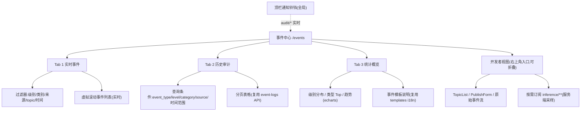

# 事件中心 Web 设计方案

> 日期:2026-08-28
> 前置阅读:[Event-Bus 架构审查报告](./event-bus-review.md)(问题编号 P1-P7 沿用该报告)
> 性质:设计方案,供团队评审;**本文档不伴随任何代码改动**

---

## 1. 目标与非目标

### 1.1 目标

1. 把现有隐藏的 events 调试页(`web/src/pages/events/`,路由已有、菜单无入口)升级为**产品级事件中心**:实时事件流 + 历史审计查询 + 统计概览。
2. 打通两套事件体系:审计事件(`event_logs`)实时可推送,消除"审计只能轮询"的现状(审查报告 P2)。
3. WebSocket 通路从全量广播升级为按客户端订阅,高频推理事件默认隔离(审查报告 P1)。
4. 关键流程(应用安装/卸载进度、启停、模型加载)由 5s 轮询改为事件驱动。

### 1.2 非目标

- 不改变 dashboard 的轮询模式(数据面 vs 事件面分离,见 §1.3 决策 3)。
- 不引入外部 broker(NATS/MQTT/Redis)——纯内存轻量总线定位经审查确认保留。
- 不在本期实现 event-bus 持久化/限流/优先级路由等未实现承诺(审查报告 P3),仅按需清理。
- 不承诺 `inference/*` 事件回放(高频、时效性强,可丢)。

### 1.3 设计决策记录(ADR)

| # | 决策 | 内容 | 理由 |
|---|---|---|---|
| 1 | events 页面定位 | **产品级事件中心**,加入侧边栏;现有调试能力(TopicList/PublishForm/原始流)降级为中心内"开发者视图" | 审计+实时事件是边缘设备运维的高价值入口;调试能力保留但不面向普通用户 |
| 2 | 实时化范围 | **事件中心 + 关键流程**(app 安装/卸载/启停、模型加载);dashboard 维持轮询 | 事件驱动投入集中在用户可感知的流程;dashboard 指标类数据轮询成本已可接受 |
| 3 | 高频推理事件 | `inference/**` **默认排除**于 web 事件流;开发者视图按需订阅,服务端过滤+采样 | 实测 42-47 FPS;全量进浏览器必然打爆(审查报告 P1) |
| 4 | 产出形式 | 本期仅设计文档,不改代码 | 当前分支 `feat/app-models-import-unify` 有未提交改动;方案需团队评审 |

---

## 2. 信息架构

### 2.1 侧边栏与路由

```
侧边栏(现 menu.tsx 顺序):          新增:
  仪表盘                              …
  媒体 / 图像                          事件中心  ← 插在"应用"之后
  应用                                …
  模型
  外设
  设置 / 维护
```

- 路由 `/events` 已存在(`web/src/router/index.tsx:59`),无需新增;仅需在 `web/src/layout/pc/menu.tsx` 增加菜单项。
- 权限:沿用现有菜单的可见性机制;开发者视图内的操作(发布事件)可后续挂管理员角色,首期不引入新权限模型。

### 2.2 页面结构



**三 Tab + 全局铃铛职责边界**:

| 区域 | 数据源 | 刷新机制 |
|---|---|---|
| 实时事件 | WebSocket(订阅 `audit/**`, `app/**`, `device/**`, `storage/*`, `config/*`, `user/*`, `network/*`, `firmware/*`) | 推送 |
| 历史审计 | REST `/api/v1/event-logs` | 手动查询 + 分页 |
| 统计概览 | REST `/api/v1/event-logs/statistics` + `/templates` | 进入时拉取 |
| 开发者视图 | WebSocket 按需订阅任意 topic(含 `inference/**`) | 推送 |

---

## 3. 页面设计

### 3.1 实时事件 Tab

**布局**:过滤器栏(顶部,可折叠)+ 虚拟滚动列表(主体)+ 暂停/清空/导出工具条。

**事件行**(复用 `event_logs` 的字段语义,总线事件对齐到同一行模型):

```
[级别色条] [时间 HH:mm:ss] [类别徽标] 事件文案(zh/en 模板渲染)   [来源] [topic]
```

- 级色:info=中性、warning=琥珀、error=红、critical=红+加粗(对齐 `common/events/types.go` 的 Level 定义)。
- 文案渲染:总线 `audit/*` 事件 payload 直接携带落库同款 message_en/message_zh(见 §4.2),前端按当前语言取用,保证实时流与历史审计**文案一致**;无模板的 topic(如用户应用自定义事件)回退显示 `topic + payload 摘要`。

**过滤器**(全部客户端侧,数据已在内存):
- 级别(多选)、类别(operation/system)、来源(多选,来自已收事件的 source 去重)、topic 前缀、时间范围、关键字。
- 过滤器状态写入 URL search params(可分享/可恢复)。

**列表管理**:
- 环形缓冲 500 条(现调试页为 200,产品化后略增),超出丢最旧。
- "暂停"按钮:冻结渲染但继续接收(缓冲上限内),便于排查时定格。
- 导出:当前过滤结果下载 JSON/CSV(纯前端,不新增后端端点)。

### 3.2 历史审计 Tab

复用现有 `/api/v1/event-logs` 能力,页面提供:

- 查询条件:event_type(下拉,数据源 `/templates`)、level、category、source、时间范围(预置今天/近7天/近30天)。
- 结果表格:时间 / 级别 / 类别 / 文案(当前语言)/ 来源 / 用户。行点击展开详情(metadata、raw message)。
- **实时联动**(依赖 Phase 2 审计桥,Phase 1 仅静态查询):查询结果顶部提示"有 N 条新事件"横幅,点击合并进当前视图——不做自动刷新表格,避免打断阅读。

### 3.3 统计概览 Tab

- 卡片:今日事件数、warning/error 数、最活跃来源。
- 图表(echarts,项目已有依赖):按级别堆叠的近 7 天趋势、event_type Top10 柱状。
- 数据源 `/api/v1/event-logs/statistics`;首期进入页面拉一次,不轮询。

### 3.4 顶栏通知铃铛(全局)

- 数据源:与实时 Tab 同一条 WS 连接的 `audit/*` 子集,仅 level ≥ warning 的入铃。
- 交互:未读计数徽标;下拉最近 20 条;点击跳转事件中心(带级别过滤参数)。
- 桌面通知浏览器 Notification API 首期**不做**(需授权流,收益待验证)。

### 3.5 开发者视图(现调试能力的归宿)

- 入口:事件中心右上角"开发者视图"开关,展开为抽屉/下半区。
- 保留现四件套:TopicList(`GET /events/topics`)、SubscriptionPanel、PublishForm(`POST /events/publish`)、原始事件流(payload 原文)。
- 订阅 `inference/**` 时:**服务端采样**(建议首期限 2-5 msg/s/topic,见 §4.1 协议的 `sample_rate`),UI 明示"已采样"。
- 该视图面向开发/联调,文案可保留英文技术风格,不做产品化润色。

---

## 4. 后端配套改造建议(评审通过后实施,按 Phase 排期)

### 4.1 WS 订阅协议(Phase 1,解 P1)

连接建立后客户端发首帧控制消息,服务端按连接维护订阅集:

```jsonc
// C → S 订阅/退订(可多次,增量)
{"action": "subscribe", "topics": ["audit/**", "app/**"], "sample_rate": 0}
{"action": "unsubscribe", "topics": ["app/**"]}

// S → C 确认 + 事件信封
{"action": "subscribed", "topics": [...], "sampled": ["inference/**"]}
{"action": "event", "topic": "app/app.installed", "event": {...}}
```

服务端规则:
- **默认拒绝 `*` / `**` 裸全量订阅**;`inference/**` 显式订阅才生效,且强制套用采样(服务端 token bucket)。
- 实现形态:platform-api 的 `EventStream` 不再对总线单订阅 `*`,而是**按客户端订阅集聚合**去 event-bus 订阅(引用计数:某 topic 模式有 ≥1 WS 客户端才向总线订阅,归零即退订)。
- 兼容:升级期间未发首帧的旧客户端按"默认集"(`audit/**`,`app/**`,`device/**`,`storage/*`,排除 `inference/**`)处理,不破坏现有页面。
- 顺带修复:`CheckOrigin` 收紧(审查报告 P7)、URL `?topic=` 参数可作为首帧订阅的等价物(让现有 `getStreamUrl` 真正生效,`web/src/services/api/events.ts:12-19` 现为无效参数)。

### 4.2 审计桥(Phase 2,解 P2)

- `events.Logger`(或其调用侧)在落库同时向总线发布:
  - topic:`audit/<event_type>`(如 `audit/app.installed`、`audit/user.login.success`);
  - metadata:`level` / `category` / `source` / `user` / `event_log_id`;
  - payload:JSON(字段与 `event_logs` 行一致,message_en/message_zh 直接带上,前端零模板成本——比让前端查模板更简单)。
- 落库失败不影响发布、发布失败不影响落库(两者互不阻塞,均只记日志)。
- storage 事件已有双写先例(`NewStorageHandlers` 同时接 publishFunc 与 eventLogger,`platform/platform-api/server/main.go:859` 附近),迁移为统一桥后**去重其总线侧发布**,避免双份。
- 与 `app/app.installed` 的关系:app-manager 既有总线事件保留(面向机器订阅者),审计桥补的是**面向人**的统一审计流;两者 metadata 都带 app_id,前端可关联。topic 命名统一(审查报告 P7)排入同一 Phase 顺带处理。

### 4.3 关键流程事件驱动(Phase 3)

| 流程 | 现状 | 目标 |
|---|---|---|
| 应用安装/卸载 | install task 轮询 | 任务进度事件 `app/install.progress`(metadata: task_id/app_id/step/percent),前端按 task_id 订阅,进度条实时 |
| 应用启停 | apps 列表轮询 | WS 收 `app/app.started` / `app/app.stopped` 后 invalidate 对应 query(TanStack Query 缓存失效,而非弃用 REST) |
| 模型加载 | 模型页轮询 | `ai.model.loaded` / 加载失败事件驱动刷新(该事件类型已在 `common/events/types.go` 定义) |

原则:**REST 仍是数据真源,事件只做"何时去刷新"的信号**——避免把事件流当状态存储(总线不持久、可丢,审查报告 P5),前端不承担事件计数聚合的正确性责任。

### 4.4 重连 catch-up(Phase 3,解 P5)

- platform-api 维护低频 topic(默认订阅集范围)最近 N=500 条环形缓冲(内存,进程级,不落盘)。
- WS 重连时客户端回传 `{"action": "subscribe", ..., "last_event_id": "..."}`,服务端补发缓冲中其后的事件,再进入实时推送。
- `inference/**` 不参与 catch-up(开发者视图断线即丢,UI 明示)。

### 4.5 配套清理(随各 Phase 顺带)

- `docs/services/event-bus.md` 失实点修正与 `configs/platform/event-bus.yaml` 死配置清理(清单见审查报告 P3/P4)。
- app-manager topic 去双前缀(P7)。

---

## 5. 前端实现要点

### 5.1 `useEventStream` 改造(核心 hook)

现状:`web/src/hooks/useEvents.ts` 的 `useEventStream` 每次调用新建 WS、`onmessage` 不过滤、缓冲 200 条。改造为:

```text
useEventStream(subscriptions: Sub[]) → { events, status, send }
  - 模块级单例连接:多组件共享一条 WS(引用计数,最后一个取消才断开)
  - subscriptions 变化时增量发 subscribe/unsubscribe 帧
  - 服务端已过滤 → 客户端不再按 topic 过滤,仅做 UI 级(级别/关键字)过滤
  - 指数退避自动重连(1s/2s/4s… 上限 30s),重连成功携带 last_event_id(Phase 3)
  - status: connecting | open | reconnecting | error → 页面顶部连接状态指示
```

- 事件列表用 `useSyncExternalStore` 桥接,避免每事件一次 setState 引发全列表重渲染;列表本体虚拟滚动(候选 `@tanstack/react-virtual`,或项目内既有方案优先)。
- 铃铛与事件中心 Tab 共享同一单例连接、各自的过滤器。

### 5.2 组件复用清单

| 需求 | 复用 | 新建 |
|---|---|---|
| 事件行/级别徽标 | 现有 Badge 组件 + `common/events` 级别色约定 | `EventRow` |
| 实时列表 | — | `LiveEventList`(虚拟滚动) |
| 历史查询表格 | 现有 Table/分页模式(maintenance/logs 同款) | 查询条件栏 |
| 统计图表 | echarts 封装(dashboard 已用) | 堆叠趋势/Top10 配置 |
| 铃铛 | radix Popover + Badge | `NotificationBell` |
| 开发者视图 | 现 events 页四件套原样迁移 | 抽屉容器 |

### 5.3 i18n key 规划(zh/en `sys.json`)

```jsonc
// 建议命名空间 events.*
"events.title": "事件中心" / "Event Center"
"events.tabs.live": "实时事件" / "Live Events"
"events.tabs.history": "历史审计" / "Audit History"
"events.tabs.stats": "统计概览" / "Overview"
"events.filter.level": "级别" / "Level"
"events.filter.category": "类别" / "Category"
"events.filter.source": "来源" / "Source"
"events.list.pause": "暂停" / "Pause"
"events.list.resume": "继续" / "Resume"
"events.list.clear": "清空" / "Clear"
"events.list.export": "导出" / "Export"
"events.connection.open": "已连接" / "Connected"
"events.connection.reconnecting": "重连中…" / "Reconnecting…"
"events.dev.title": "开发者视图" / "Developer View"
"events.dev.sampled": "高频话题已采样" / "High-frequency topic sampled"
"events.bell.title": "通知" / "Notifications"
"events.bell.empty": "暂无告警" / "No alerts"
"events.history.newEvents": "{{count}} 条新事件" / "{{count}} new events"
```

事件**文案**本身不走这套 key——沿用 `event_logs` 落库的 message_zh/message_en(服务端模板),保证实时流/历史/铃铛三处文案同源。

### 5.4 状态与 URL

- Tab、实时过滤器(级别/类别/topic)、历史查询条件 → URL search params(`?tab=live&level=error,warn&topic=app/`)。
- 暂停态、铃铛未读数 → 组件本地态,不进 URL。

---

## 6. 分期路线与验收标准

| Phase | 范围 | 后端 | 前端 | 验收标准 |
|---|---|---|---|---|
| **1** | 事件中心可用 | WS 订阅协议(§4.1)+ 默认集 + `inference/**` 采样 | 侧边栏入口、三 Tab、`useEventStream` 单例改造、开发者视图迁移 | ① 打开事件中心,浏览器 WS 帧内**无** `inference/*` 事件;② 显式订阅 `inference/**` 后帧率 ≤ 采样上限;③ 同页多组件仅 1 条 WS 连接;④ 断网 10s 内重连成功且状态指示可见 |
| **2** | 审计桥 + 铃铛 | `audit/*` 双写(§4.2)+ storage 双写去重 | 通知铃铛、实时/历史文案同源渲染、历史"新事件"横幅 | ① 在另一浏览器会话触发应用安装,本会话铃铛 ≤2s 内出现通知且文案与历史审计表格一致;② `event_logs` 落库速率与改造前持平(桥不拖慢写路径) |
| **3** | 关键流程 + catch-up | 安装进度事件、启停/模型加载刷新信号、环形缓冲 catch-up(§4.3/4.4) | 进度条事件驱动、query invalidate、重连补发 | ① 应用安装进度条更新无轮询请求(Network 面板验证);② 断线 30s 期间产生的审计事件重连后自动出现在实时流;③ dashboard 轮询行为不变(回归确认) |

**风险与回退**:每 Phase 独立可回退——WS 协议向后兼容(未发首帧走默认集);审计桥双写两侧互不阻塞,可单独关闭总线侧;事件驱动刷新仅替代 refetchInterval,REST 数据路径不动。

---

## 7. 评审待决问题

1. `audit/*` 是否需要在 event-bus 侧做持久化兜底?(现方案:不做,Phase 3 环形缓冲足够,`event_logs` 已是持久真源)
2. 铃铛的告警级别门槛:warning 起还是 error 起?
3. 开发者视图是否需要管理员权限?(首期方案:不限制)
4. topic 命名统一(P7)放入 Phase 2 还是单独小版本?(影响 SDK 兼容公告)
