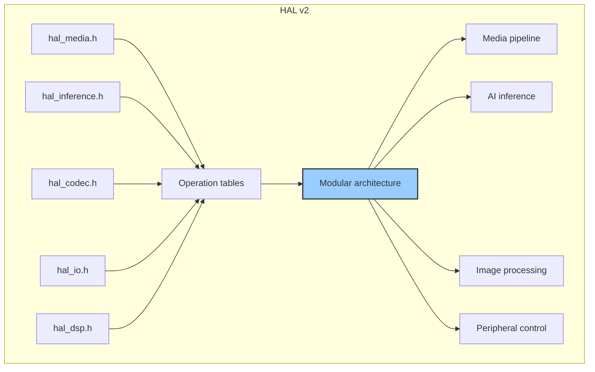
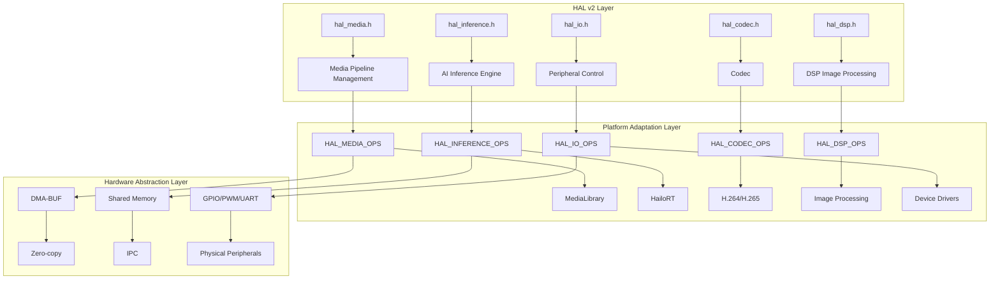
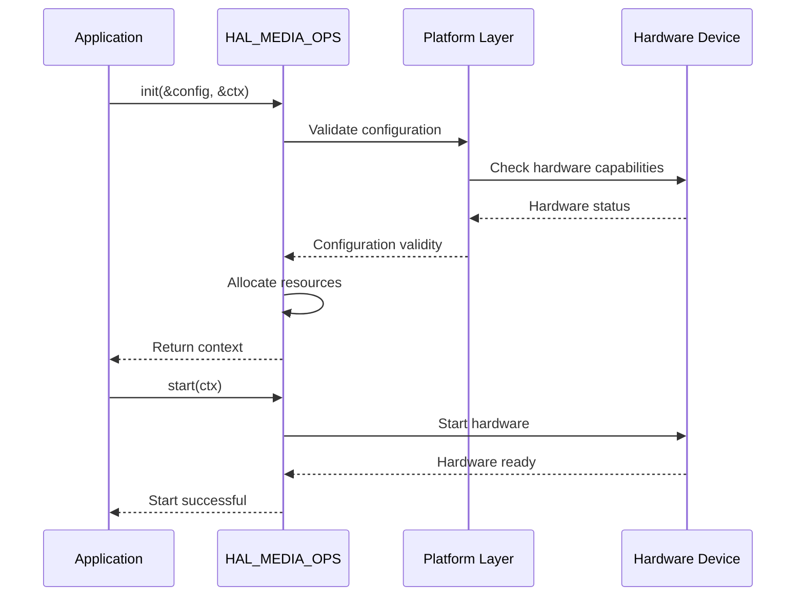
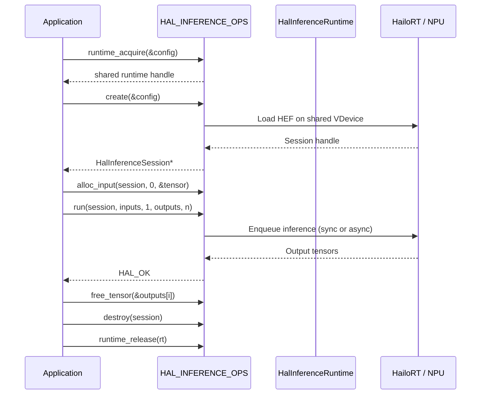
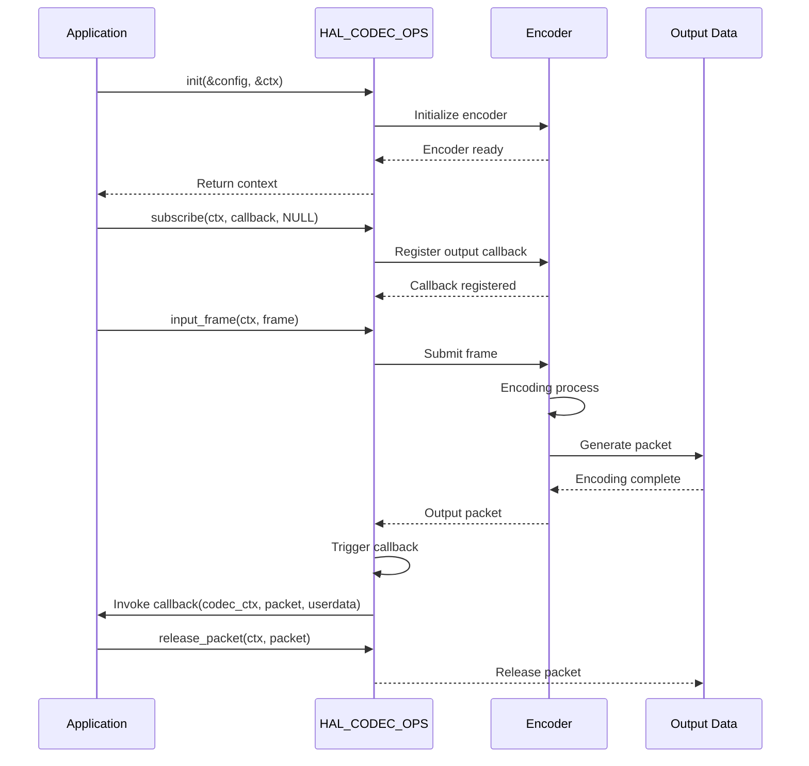

# HAL v2 API Reference

> Source of truth: `hal_v2/include/**`. Signatures below are transcribed from
> the headers (`hal_common.h`, `hal_types.h`, `hal_buffer.h`, `hal_media.h`,
> `hal_codec.h`, `hal_dsp.h`, `hal_io.h`, `hal_inference.h`) and match them
> exactly at the time of writing. The module is organized around **operation
> tables** (`HalMediaOps`, `HalCodecOps`, `HalDspOps`, `HalIoOps`,
> `HalInferenceOps`, `HAL_FRAME_BUFFER_OPS`); each platform implementation
> provides an `extern` instance resolved at link time (stub or hailol5).

## Table of Contents

- [Architecture Overview](#architecture-overview)
- [Common Type Definitions](#common-type-definitions)
- [Interface Modules](#interface-modules)
- [Error Code Table](#error-code-table)
- [Usage Examples](#usage-examples)
- [Call Flows](#call-flows)
- [Stub Mode Notes](#stub-mode-notes)

## Architecture Overview

### HAL v2 Interface Structure



### HAL v2 Modular Architecture



## Common Type Definitions

### HalStatus - Device Status

Defined in `common/hal_common.h`. Matches the lifecycle of every context
(media / codec / io):

```c
typedef enum {
    HAL_STATUS_UNINITIALIZED = 0,   /* not yet initialized */
    HAL_STATUS_INITIALIZED,         /* initialized but not running */
    HAL_STATUS_RUNNING,             /* actively capturing / encoding */
    HAL_STATUS_STOPPED,             /* explicitly stopped after running */
    HAL_STATUS_ERROR,               /* entered an error state */
    HAL_STATUS_MAX,                 /* sentinel (not a valid status) */
} HalStatus;
```

### HalErrorCode - Error Codes

Defined in `common/hal_common.h`. All HAL functions return `0` (`HAL_OK`) on
success or a **negative** error code. A small set of **positive** sentinels
signal a successful call that also performed a heavier side effect — callers
MUST test `ret < 0` for errors first.

```c
typedef enum {
    HAL_OK = 0,                 /* success */
    HAL_REINIT_PERFORMED = 1,   /* success + dynamic_change_image_config tore down and rebuilt the whole medialib (rotation, or flip-OOM fallback); encoder contexts/pools are new and must be re-attached */
    HAL_ERROR = -0x0AFF,        /* generic / unspecified error */
    HAL_ERR_INVALID_ARG,        /* one or more arguments are invalid */
    HAL_ERR_INVALID_STATE,      /* operation not allowed in current state */
    HAL_ERR_INVALID_FMT,        /* unsupported pixel / packet format */
    HAL_ERR_INVALID_SIZE,       /* buffer or dimension size is invalid */
    HAL_ERR_TIMEOUT,            /* operation timed out */
    HAL_ERR_NO_MEM,             /* memory allocation failed */
    HAL_ERR_NOT_FINISHED,       /* previous operation still in progress */
    HAL_ERR_NOT_SUPPORTED,      /* feature not supported on this platform */
    HAL_ERR_NOT_IMPLEMENTED,    /* function stub, not yet implemented */
    HAL_ERR_NOT_INITIALIZED,    /* module or context has not been initialized */
    HAL_ERR_NOT_READY,          /* resource exists but is not ready for use */
    HAL_ERR_MUTEX,              /* mutex lock / unlock failed */
    HAL_ERR_CHECK,              /* internal consistency check failed */
    HAL_ERR_RESULT,             /* upstream returned an unexpected result */
    HAL_ERR_NOT_FOUND,          /* requested resource / id does not exist */
    HAL_ERR_INSUFFICIENT_BUFFER,/* caller-supplied buffer is too small */
    HAL_ERR_PROFILE_RESTRICTED, /* profile rejected: thermal/power restriction (e.g. AI Denoise gated off) */
    HAL_ERR_PROFILE_INVALID,    /* profile rejected: validation against rules failed */
    HAL_ERR_UNKNOW,             /* unknown error */
} HalErrorCode;
```

### HalDataType - Scalar / Tensor Data Types

Defined in `common/hal_types.h`:

```c
typedef enum {
    HAL_DTYPE_UNKNOWN = 0,
    HAL_DTYPE_UINT8,
    HAL_DTYPE_INT8,
    HAL_DTYPE_UINT16,
    HAL_DTYPE_INT16,
    HAL_DTYPE_UINT32,
    HAL_DTYPE_INT32,
    HAL_DTYPE_FLOAT16,
    HAL_DTYPE_FLOAT32,
} HalDataType;
```

### HalMemoryType / HalFrameBuffer - Frame Buffer

Defined in `common/hal_buffer.h`:

```c
typedef enum {
    HAL_MEM_DMABUF = 0,         /* DMA-BUF file descriptor (zero-copy) */
    HAL_MEM_MMAP,               /* memory-mapped (V4L2 MMAP style) */
    HAL_MEM_MALLOC,             /* standard heap allocation */
} HalMemoryType;

typedef struct {
    /* metadata */
    uint32_t        width;                          /* image width in pixels */
    uint32_t        height;                         /* image height in pixels */
    HalPixelFormat  format;                         /* pixel format */
    HalMemoryType   mem_type;                       /* how the memory was allocated */
    uint32_t        sequence;                       /* monotonic frame sequence number */
    uint64_t        timestamp_ns;                   /* capture timestamp (ns, CLOCK_MONOTONIC) */

    /* plane data (multi-planar: NV12 = 2 planes, YUV420P = 3 planes, packed = 1 plane) */
    uint32_t        num_planes;                     /* number of valid planes [1..HAL_MAX_PLANES] */
    int             dma_fds[HAL_MAX_PLANES];        /* DMA-BUF fds, -1 if not applicable */
    void           *planes[HAL_MAX_PLANES];         /* user-space virtual addresses (may be NULL for DMABUF-only) */
    uint32_t        strides[HAL_MAX_PLANES];        /* bytes per row including padding */
    uint32_t        sizes[HAL_MAX_PLANES];          /* total allocation size per plane in bytes */

    void           *metadata;                       /* platform-specific metadata (opaque) */
    void           *priv;                           /* platform-private data (ref-counted internally) */
} HalFrameBuffer;
```

### HalTensor - Inference Tensor

Defined in `model/hal_inference.h`. Carries either CPU memory (`data`) or a
DMA-BUF fd (`dma_fd`) for zero-copy input:

```c
#define HAL_MAX_TENSOR_NAME  64
#define HAL_MAX_TENSORS      16
#define HAL_MAX_TENSOR_DIMS  8

typedef struct {
    char name[HAL_MAX_TENSOR_NAME];     /* tensor name */
    void *data;                         /* data pointer (CPU memory) */
    int32_t ndim;                       /* number of dimensions */
    int32_t shape[HAL_MAX_TENSOR_DIMS]; /* shape per dimension */
    HalDataType dtype;                  /* data type */
    uint32_t byte_size;                 /* total size in bytes */
    int32_t dma_fd;                     /* DMA-BUF fd, -1 for CPU memory */
    void *priv;                         /* platform-specific private data */
} HalTensor;
```

### HalModelInfo - Model Information

Defined in `model/hal_inference.h`. Per-input / per-output streams are
described by `HalModelTensorInfo` (name, shape, dtype, layout, quantization,
host byte size, and NMS flags for HailoRT NMS streams):

```c
typedef struct {
    /** Model path / identifier (implementation may set file path). */
    char name[128];
    /** Runtime label, e.g. "hailort". */
    char version[32];
    /** First network name from HEF (empty if unknown). */
    char network_name[128];
    /** First network group name from HEF (empty if unknown). */
    char network_group_name[64];
    uint32_t num_inputs;
    uint32_t num_outputs;

    HalModelTensorInfo inputs[HAL_MAX_TENSORS];
    HalModelTensorInfo outputs[HAL_MAX_TENSORS];
} HalModelInfo;
```

The inference session itself is an opaque handle `HalInferenceSession`
(forward-declared in `model/hal_inference.h`); there is no separate
"model handle" type.

## Interface Modules

### HalMediaOps - Media Pipeline Operations

Defined in `media/hal_media.h`. Lifecycle plus profile, stream, and dynamic
image control:

```c
typedef struct {
    /* Lifecycle */
    int (*init)(const HalMediaConfig *config, void **media_ctx_return);
    int (*deinit)(void *media_ctx);
    int (*start)(void *media_ctx);
    int (*stop)(void *media_ctx);
    int (*get_status)(void *media_ctx);

    /* Profile management */
    int (*get_current_profile)(void *media_ctx, char **profile_name);
    int (*get_profile_list)(void *media_ctx, char **profile_list, uint32_t *profile_list_count);
    int (*switch_profile)(void *media_ctx, const char *profile_name, bool force_recycle);

    /* Context retrieval */
    int (*get_video_list)(void *media_ctx, void **video_list, uint32_t *video_list_count);
    int (*get_codec_list)(void *media_ctx, void **codec_list, uint32_t *codec_list_count);
    int (*get_current_config)(void *media_ctx, HalMediaConfig *config);
    int (*get_current_profile_json)(void *media_ctx, const char **json_out);
    int (*backup_current_profile)(void *media_ctx, const char *path);

    /* Dynamic configuration */
    int (*dynamic_change_image_config)(void *media_ctx, const HalMediaImageConfig *config);

    /* Stream management */
    int (*add_video_stream)(void *media_ctx, const HalMediaAddVideoConfig *config);
    int (*add_codec_stream)(void *media_ctx, const HalMediaAddCodecConfig *config);
    int (*add_streams_batch)(void *media_ctx, const HalMediaAddCodecConfig *codec_cfg,
                             const HalMediaAddVideoConfig *video_cfg);
    int (*remove_video_stream)(void *media_ctx, const HalMediaRemoveVideoConfig *config);
    int (*remove_codec_stream)(void *media_ctx, const HalMediaRemoveCodecConfig *config);
    int (*remove_streams_batch)(void *media_ctx, const char *stream_id);

    /* Encoder auto-feed */
    int (*set_encoder_auto_feed)(void *media_ctx, bool enable);
    int (*get_encoder_auto_feed)(void *media_ctx, bool *enable_out);
    int (*set_encoder_auto_feed_for_stream)(void *media_ctx, const char *stream_id, bool enable);
    int (*get_encoder_auto_feed_for_stream)(void *media_ctx, const char *stream_id, bool *enable_out);

    /* Per-stream parameter override / pipeline reconfigure */
    int (*override_stream_params)(void *media_ctx, const HalStreamOverrideBatch *batch);
    int (*reconfigure_pipeline)(void *media_ctx, const HalPipelineReconfig *reconfig);

    /* Analytics frame attachment (dynamic privacy masking) */
    int (*attach_frame_analytics)(void *media_ctx, HalFrameBuffer *frame, ...);

    /* Version information */
    const char *(*get_version)(void);
} HalMediaOps;
```

**Key features:**
- Unified media pipeline lifecycle management
- Profile switching (`switch_profile` with `force_recycle`)
- Dynamic image parameter adjustment (`dynamic_change_image_config` — rotation,
  flip, digital zoom, dewarp/LDC, DIS/EIS, grayscale, privacy mask)
- Frontend-to-encoder auto-feed
- Privacy mask (static polygon + dynamic AI-driven bbox / segmentation)
- Per-stream overrides and pipeline reconfigure

### HalInferenceOps - AI Inference Operations

Defined in `model/hal_inference.h`. Session-based; zero-copy via DMA-BUF;
supports synchronous and asynchronous inference plus a shared multi-model
runtime:

```c
typedef struct HalInferenceOps {
    HalInferenceSession* (*create)(const HalInferenceConfig *config);
    void (*destroy)(HalInferenceSession *session);
    int (*get_model_info)(HalInferenceSession *session, HalModelInfo *info);

    /* Zero-copy tensor management */
    int (*alloc_input)(HalInferenceSession *session, int input_idx, HalTensor *tensor);
    int (*tensor_from_frame)(const HalFrameBuffer *frame, HalTensor *tensor);
    void (*free_tensor)(HalTensor *tensor);

    /* Inference execution */
    int (*run)(HalInferenceSession *session,
               const HalTensor *inputs, int num_inputs,
               HalTensor *outputs, int num_outputs);
    int (*run_async)(HalInferenceSession *session,
                     const HalTensor *inputs, int num_inputs,
                     HalTensor *outputs, int num_outputs,
                     HalInferenceAsyncCallback callback,
                     void *userdata);

    /* Shared multi-model runtime (one VDevice per group, ref-counted) */
    HalInferenceRuntime* (*runtime_acquire)(const HalInferenceRuntimeConfig *config);
    void (*runtime_release)(HalInferenceRuntime *runtime);

    /* Performance stats */
    int (*query_session_performance_stats)(HalInferenceSession *session,
                                           uint32_t sampling_period_ms,
                                           HalInferenceSessionPerfStats *out);
    int (*query_system_performance_stats)(const char *device_id,
                                          uint32_t sampling_period_ms,
                                          HalInferencePerfStats *out);

    const char* (*get_version)(void);
} HalInferenceOps;
```

**Key features:**
- Session-based model load via `create()` / `destroy()`
- Synchronous `run()` and asynchronous `run_async()` with completion callback
- Zero-copy input via `alloc_input()` / `tensor_from_frame()` (DMA-BUF)
- Shared `HalInferenceRuntime` for multi-model scheduling (HailoRT Model
  Scheduler, Round-Robin; `HAL_INFER_DEFAULT_VDEVICE_GROUP_ID "aipc"`)
- Per-session and system-wide performance stats (`fps`, `npu_utilization`,
  queue depth, hardware latency)
- GenAI streaming inference lives in `model/hal_genai.h` (separate interface)

### HalCodecOps - Codec Operations

Defined in `media/hal_codec.h`. Push/pull hybrid — submit frames with
`input_frame()`, receive encoded packets via `subscribe()` callback, release
with `release_packet()`:

```c
typedef struct {
    /* Lifecycle */
    int (*init)(const HalCodecConfig *config, void **codec_ctx_return);
    int (*deinit)(void *codec_ctx);
    int (*start)(void *codec_ctx);
    int (*stop)(void *codec_ctx);
    int (*get_status)(void *codec_ctx);
    int (*get_current_config)(void *codec_ctx, HalCodecConfig *config);
    int (*dynamic_change_config)(void *codec_ctx, const HalCodecConfig *config);

    /* Frame input */
    int (*input_frame)(void *codec_ctx, HalFrameBuffer *frame);

    /* Encoded packet delivery (push mode) */
    int (*subscribe)(void *codec_ctx, HalCodecFrameCallback callback, void *userdata);
    int (*unsubscribe)(void *codec_ctx, HalCodecFrameCallback callback);
    int (*release_packet)(void *codec_ctx, HalPacketBuffer *packet);

    /* FROM_MEDIA encoder registration */
    int (*init_from_context)(void *codec_ctx, const char *stream_name);
    int (*deinit_from_context)(int encoder_handle);

    const char *(*get_version)(void);
} HalCodecOps;
```

**Key features:**
- H.264 / H.265 / MJPEG encoding (`HalCodecConfig.packet_type`)
- Dynamic bitrate / QP / resolution change (`dynamic_change_config`)
- Asynchronous frame submission + push callback for encoded packets
- `FROM_MEDIA` codecs obtained from the media pipeline (`get_codec_list()`)
  attached via `init_from_context()` without creating a new encoder

### HalIoOps - Peripheral Operations

Defined in `peripheral/hal_io.h`. GPIO export/unexport + edge subscription,
and PWM channels (may return `HAL_ERR_NOT_SUPPORTED` on platforms without PWM):

```c
typedef struct {
    /* Lifecycle */
    int (*init)(void **io_ctx_return);
    int (*deinit)(void *io_ctx);

    /* GPIO */
    int (*gpio_export)(void *io_ctx, const HalGpioConfig *config);
    int (*gpio_unexport)(void *io_ctx, uint32_t gpio_num);
    int (*gpio_set_value)(void *io_ctx, uint32_t gpio_num, bool value);
    int (*gpio_get_value)(void *io_ctx, uint32_t gpio_num, bool *value);
    int (*gpio_set_direction)(void *io_ctx, uint32_t gpio_num, HalGpioDirection dir);
    int (*gpio_subscribe)(void *io_ctx, uint32_t gpio_num, HalGpioEdge edge,
                          HalGpioEventCallback callback, void *userdata);
    int (*gpio_unsubscribe)(void *io_ctx, uint32_t gpio_num);

    /* PWM (may be unsupported) */
    int (*pwm_configure)(void *io_ctx, const HalPwmConfig *config);
    int (*pwm_set_duty)(void *io_ctx, uint32_t pwm_chip, uint32_t pwm_channel, uint32_t duty_ns);
    int (*pwm_enable)(void *io_ctx, uint32_t pwm_chip, uint32_t pwm_channel, bool enable);

    const char *(*get_version)(void);
} HalIoOps;
```

**Key features:**
- GPIO export / direction / value with edge-triggered event subscription
- PWM channel configuration (period, duty, enable)
- MCU / device control is separate — see `peripheral/hal_mcu.h`
  (`hal_mcu` + host_link protocol)

### HalDspOps - DSP Image Processing Operations

Defined in `dsp/hal_dsp.h`. Two styles: convenience synchronous helpers and a
job-based async `submit()`/`wait()` flow:

```c
typedef struct {
    /* Lifecycle */
    int (*init)(const HalDspConfig *config, void **dsp_ctx_return);
    int (*deinit)(void *dsp_ctx);

    /* Convenience synchronous helpers */
    int (*convert_format)(void *dsp_ctx, const HalDspConvertFormatParams *params);
    int (*resize)(void *dsp_ctx, const HalDspResizeParams *params);
    int (*crop_and_resize)(void *dsp_ctx, const HalDspCropResizeParams *params);
    int (*multi_crop_and_resize)(void *dsp_ctx, const HalDspMultiCropResizeParams *params);
    int (*blend)(void *dsp_ctx, const HalDspBlendParams *params);
    int (*flip_rotate)(void *dsp_ctx, const HalDspFlipRotateParams *params);
    int (*privacy_mask)(void *dsp_ctx, const HalDspPrivacyMaskParams *params);

    /* Job-based asynchronous API */
    int (*submit)(void *dsp_ctx, HalDspOpType op_type, const void *params, HalDspJobHandle *job_out);
    int (*wait)(void *dsp_ctx, HalDspJobHandle job, uint32_t timeout_ms, HalDspJobResult *result_out);
    int (*cancel)(void *dsp_ctx, HalDspJobHandle job);
    int (*job_release)(void *dsp_ctx, HalDspJobHandle job);

    const char *(*get_version)(void);
} HalDspOps;
```

**Key features:**
- Format conversion, resize, crop-and-resize, multi-crop, blend, flip/rotate
- Privacy mask application (polygon + AI-driven)
- Job-based async execution (`submit` → `wait` / `cancel` → `job_release`)

## Error Code Table

`HalErrorCode` values are **sequential negative codes** after `HAL_ERROR
(-0x0AFF)`. `HAL_OK` is `0`; positive sentinels (e.g. `HAL_REINIT_PERFORMED`)
are success-with-side-effect, never errors.

| Error Code | Value (offset from HAL_ERROR) | Description |
|------------|-------------------------------|-------------|
| HAL_OK | 0 | Success |
| HAL_REINIT_PERFORMED | +1 | Success + medialib rebuilt (rotation / flip-OOM fallback); re-attach encoder contexts |
| HAL_ERROR | -0x0AFF | General error |
| HAL_ERR_INVALID_ARG | -1 | Invalid argument |
| HAL_ERR_INVALID_STATE | -2 | Invalid state |
| HAL_ERR_INVALID_FMT | -3 | Unsupported format |
| HAL_ERR_INVALID_SIZE | -4 | Invalid size |
| HAL_ERR_TIMEOUT | -5 | Operation timeout |
| HAL_ERR_NO_MEM | -6 | Memory allocation failed |
| HAL_ERR_NOT_FINISHED | -7 | Previous operation still in progress |
| HAL_ERR_NOT_SUPPORTED | -8 | Unsupported feature |
| HAL_ERR_NOT_IMPLEMENTED | -9 | Not implemented |
| HAL_ERR_NOT_INITIALIZED | -10 | Not initialized |
| HAL_ERR_NOT_READY | -11 | Resource not ready |
| HAL_ERR_MUTEX | -12 | Mutex error |
| HAL_ERR_CHECK | -13 | Internal check failed |
| HAL_ERR_RESULT | -14 | Upstream returned abnormal result |
| HAL_ERR_NOT_FOUND | -15 | Resource not found |
| HAL_ERR_INSUFFICIENT_BUFFER | -16 | Buffer too small |
| HAL_ERR_PROFILE_RESTRICTED | -17 | Profile rejected (thermal/power restriction) |
| HAL_ERR_PROFILE_INVALID | -18 | Profile rejected (validation failed) |
| HAL_ERR_UNKNOW | -19 | Unknown error |

Use `hal_error_to_string(code)` (`common/hal_common.h`) to render an error
code as a string.

## Usage Examples

### Media Pipeline Initialization Example

```c
#include <hal_media.h>

int main() {
    HalMediaConfig media_config = {
        .config_path = "/etc/imaging/cfg/medialib_configs/profile.json",
        .backup_folder_path = "/data/aipc/backups",
        .image_config = {
            .rotation_angle = HAL_ROTATION_ANGLE_0,
            .flip_direction = HAL_FLIP_DIRECTION_NONE,
            .dewarp = false,
            .dis = false,
            .privacy_mask = false
        },
        .priv = NULL
    };

    void *media_ctx = NULL;
    int ret = HAL_MEDIA_OPS.init(&media_config, &media_ctx);
    if (ret < 0) {
        printf("Failed to init media: %s\n", hal_error_to_string(ret));
        return -1;
    }

    // Start media pipeline
    ret = HAL_MEDIA_OPS.start(media_ctx);
    if (ret < 0) {
        printf("Failed to start media: %s\n", hal_error_to_string(ret));
        HAL_MEDIA_OPS.deinit(media_ctx);
        return -1;
    }

    printf("Media pipeline started successfully\n");

    // Get video context
    void *video_ctx = NULL;
    void *video_list[8];
    uint32_t video_count = 0;
    ret = HAL_MEDIA_OPS.get_video_list(media_ctx, video_list, &video_count);
    if (ret == HAL_OK && video_count > 0) {
        video_ctx = video_list[0];
        printf("Got video context with type HAL_VIDEO_TYPE_FROM_MEDIA\n");
    }

    // ... Use video stream ...

    // Cleanup
    HAL_MEDIA_OPS.stop(media_ctx);
    HAL_MEDIA_OPS.deinit(media_ctx);

    return 0;
}
```

### AI Inference Example

```c
#include <hal_inference.h>

int run_ai_pipeline() {
    HalInferenceConfig config = {
        .model_path = "/data/aipc/models/person_detection.hef",
        .batch_size = 1,
        .timeout_ms = 1000,
        .use_dma = true,
    };
    // For concurrent multi-model inference, acquire a shared runtime and set
    // config.runtime — see hal_inference_runtime_config_defaults().
    hal_inference_runtime_config_defaults(&runtime_cfg);
    HalInferenceRuntime *rt = HAL_INFERENCE_OPS.runtime_acquire(&runtime_cfg);
    config.runtime = rt;

    // Create session (loads the model on the NPU)
    HalInferenceSession *session = HAL_INFERENCE_OPS.create(&config);
    if (!session) {
        printf("Failed to create inference session\n");
        HAL_INFERENCE_OPS.runtime_release(rt);
        return -1;
    }

    // Get model info
    HalModelInfo info;
    int ret = HAL_INFERENCE_OPS.get_model_info(session, &info);
    if (ret < 0) {
        printf("Failed to get model info: %s\n", hal_error_to_string(ret));
        HAL_INFERENCE_OPS.destroy(session);
        HAL_INFERENCE_OPS.runtime_release(rt);
        return -1;
    }
    printf("Model: %s, inputs: %u, outputs: %u\n",
           info.name, info.num_inputs, info.num_outputs);

    // Allocate input / output tensors
    HalTensor inputs[1], outputs[HAL_MAX_TENSORS];
    ret = HAL_INFERENCE_OPS.alloc_input(session, 0, &inputs[0]);
    if (ret < 0) { /* handle error */ }

    // Inference loop
    for (int i = 0; i < 100; i++) {
        // Fill inputs[0] (CPU memory or dma_fd)
        ret = HAL_INFERENCE_OPS.run(session, inputs, 1, outputs, info.num_outputs);
        if (ret < 0) {
            printf("Inference failed: %s\n", hal_error_to_string(ret));
        }
        // Process outputs[] ... then free tensors allocated by run()
        HAL_INFERENCE_OPS.free_tensor(&outputs[0]);
    }

    // Cleanup
    HAL_INFERENCE_OPS.destroy(session);
    HAL_INFERENCE_OPS.runtime_release(rt);
    return 0;
}
```

### Encoder Example

```c
#include <hal_codec.h>

int run_encoder() {
    HalCodecConfig codec_config = {
        .type = HAL_CODEC_TYPE_HW,
        .packet_type = HAL_PACKET_TYPE_H264,
        .bitrate = 2000000,      // 2 Mbps
        .framerate = 30,
        .width = 1920,
        .height = 1080,
        .gop_size = 30,
        .media_ptr = NULL
    };

    void *codec_ctx = NULL;
    int ret = HAL_CODEC_OPS.init(&codec_config, &codec_ctx);
    if (ret < 0) {
        printf("Failed to init codec: %s\n", hal_error_to_string(ret));
        return -1;
    }

    // Subscribe to encoded packet delivery
    ret = HAL_CODEC_OPS.subscribe(codec_ctx, encoder_callback, NULL);
    if (ret < 0) {
        printf("Failed to subscribe to encoder: %s\n", hal_error_to_string(ret));
        HAL_CODEC_OPS.deinit(codec_ctx);
        return -1;
    }

    // Encoding loop
    for (int i = 0; i < 100; i++) {
        HalFrameBuffer *input_frame = NULL;
        // Get input frame (from media pipeline or HAL_FRAME_BUFFER_OPS)
        // ... get_next_frame(&input_frame) ...

        if (input_frame) {
            ret = HAL_CODEC_OPS.input_frame(codec_ctx, input_frame);
            if (ret < 0) {
                printf("Encode failed: %s\n", hal_error_to_string(ret));
            }
            // Release frame
            HAL_FRAME_BUFFER_OPS.release_frame_buffer(input_frame);
        }
    }

    // Stop encoder
    HAL_CODEC_OPS.deinit(codec_ctx);
    return 0;
}

void encoder_callback(void *codec_ctx, HalPacketBuffer *packet, void *userdata) {
    printf("Encoded packet: %u bytes\n", packet->sizes[0]);
    // Send over network or save to file
    HAL_CODEC_OPS.release_packet(codec_ctx, packet);
}
```

### Peripheral Control Example

```c
#include <hal_io.h>

int control_devices() {
    void *io_ctx = NULL;
    int ret = HAL_IO_OPS.init(&io_ctx);
    if (ret < 0) {
        printf("Failed to init IO: %s\n", hal_error_to_string(ret));
        return -1;
    }

    // Export GPIO 23 as output
    HalGpioConfig cfg = {
        .gpio_num = 23,
        .direction = HAL_GPIO_DIR_OUT,
        .default_value = 0,
    };
    ret = HAL_IO_OPS.gpio_export(io_ctx, &cfg);
    if (ret < 0) {
        printf("Failed to export GPIO: %s\n", hal_error_to_string(ret));
        return -1;
    }

    // Control light
    HAL_IO_OPS.gpio_set_value(io_ctx, 23, true);   // Light on
    sleep(5);
    HAL_IO_OPS.gpio_set_value(io_ctx, 23, false);  // Light off

    // Read GPIO value
    bool value = false;
    HAL_IO_OPS.gpio_get_value(io_ctx, 23, &value);

    // Cleanup
    HAL_IO_OPS.gpio_unexport(io_ctx, 23);
    HAL_IO_OPS.deinit(io_ctx);
    return 0;
}
```

## Call Flows

### Media Pipeline Initialization Flow



### AI Inference Flow



### Encoding Flow



## Stub Mode Notes

### Stub Mode Overview

HAL v2 ships a stub platform (`hal_v2/platforms/stub/`) that allows
development and testing without hardware:

1. **Interface consistency**: Stub implements the same operation tables
   (`HAL_MEDIA_OPS`, `HAL_INFERENCE_OPS`, ...) as the real implementation
2. **Simulated data**: Returns predefined mock data or simple responses
3. **Performance optimization**: Avoids the overhead of hardware access
4. **Debug friendly**: Easy to add debug information

### Stub Implementation

The stub provides an `extern` instance of each ops table (same shape as the
real platform), so application code links unchanged:

```c
// hal_v2/platforms/stub/inference_stub.cpp (illustrative)
HalInferenceOps HAL_INFERENCE_OPS = {
    .create      = stub_create,
    .destroy     = stub_destroy,
    .run         = stub_run,
    .get_version = []() { return "HAL Stub v2.0.0"; },
    /* ... remaining members ... */
};
```

### Stub Use Cases

1. **Unit testing**: Test application logic without hardware
2. **CI/CD pipelines**: Automated testing without hardware dependencies
3. **Prototype development**: Rapidly validate feature design
4. **Debugging aid**: Isolate software issues

### Stub Limitations

1. **Feature limitations**: Some advanced features may not be simulated
2. **Performance differences**: Stub and real hardware performance differ
3. **Behavioral differences**: Error handling may differ from real hardware
4. **Resource management**: Memory allocation strategies may differ from actual behavior

### Switching from Stub to Hardware

```bash
# Build HAL stub version
make hal-v2 HAL_PLATFORM=stub

# Build Hailo-15 real version (requires SDK)
source /opt/poky/4.0.23/environment-setup-armv8a-poky-linux
make hal-v2 HAL_PLATFORM=hailo15
```

Through this design, HAL v2 provides a unified interface while supporting
flexible switching between development testing and actual deployment.
