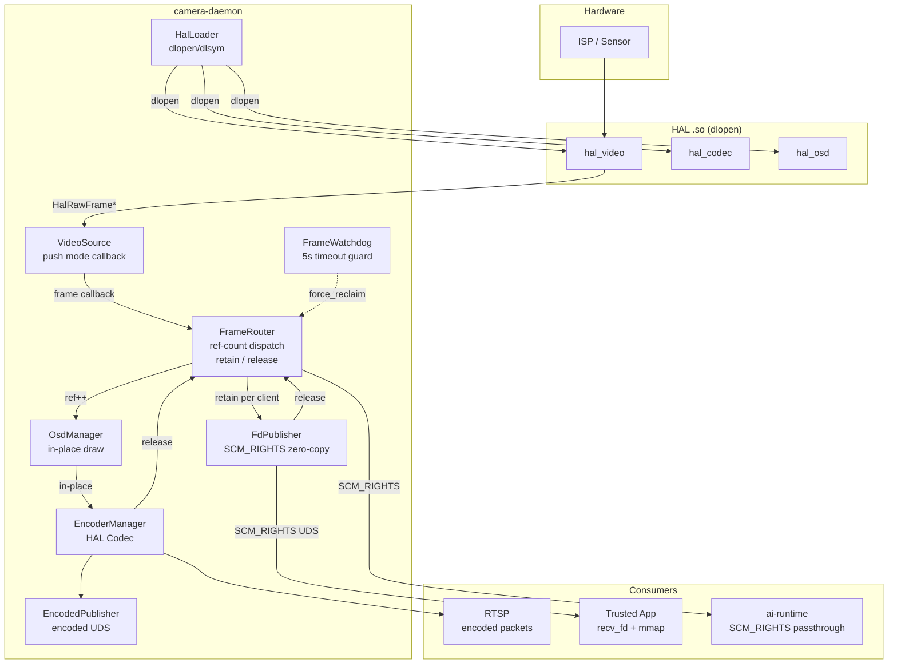
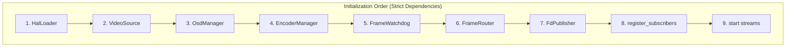
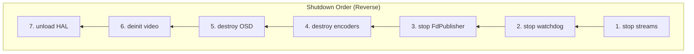
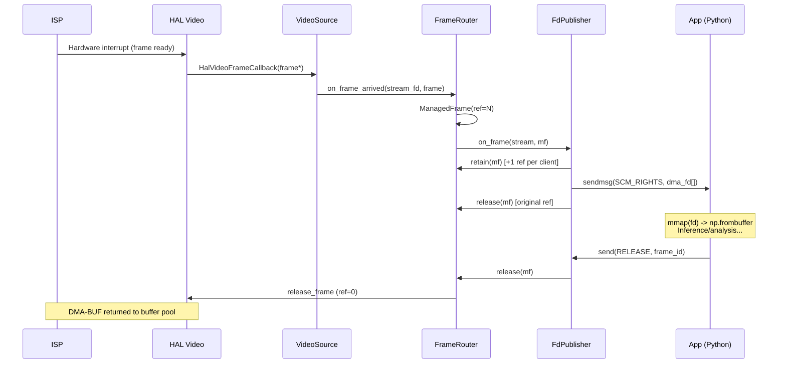
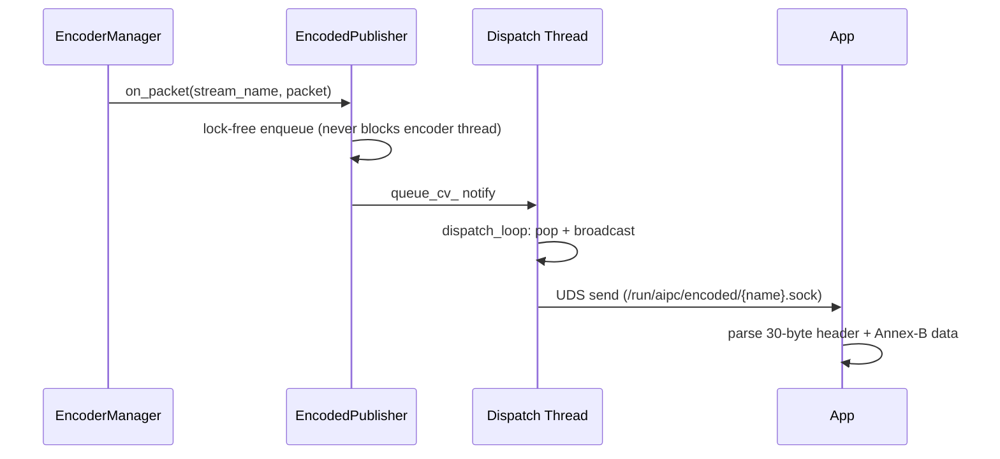
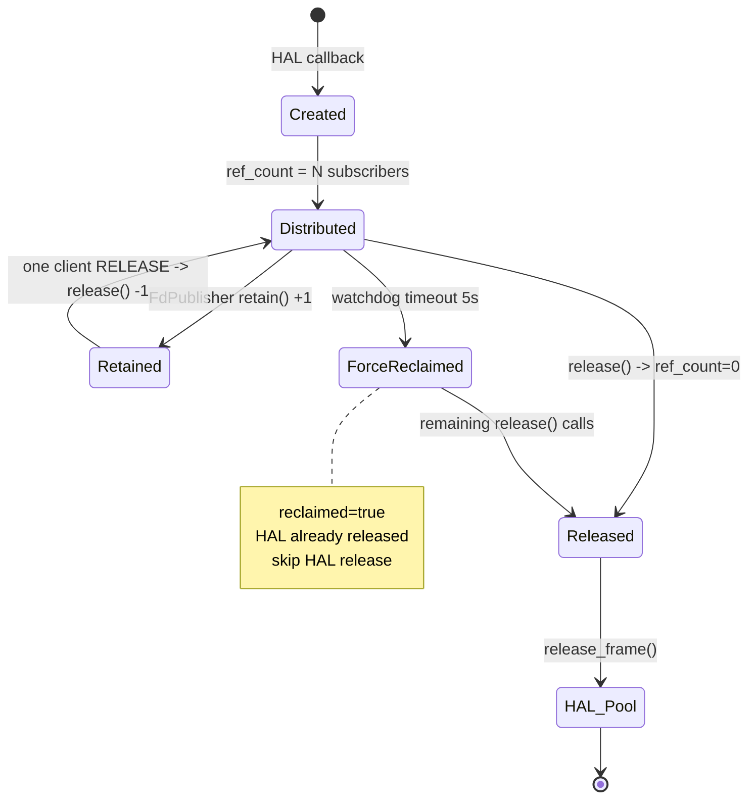
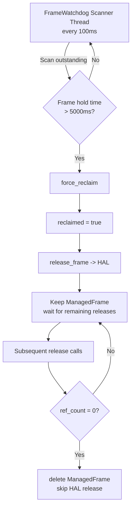
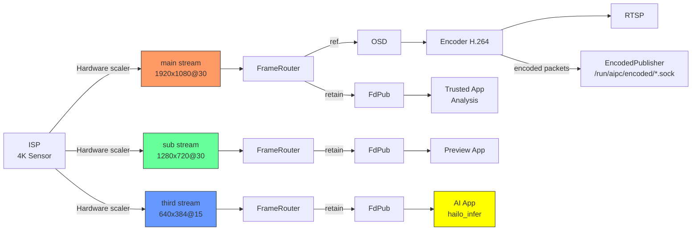
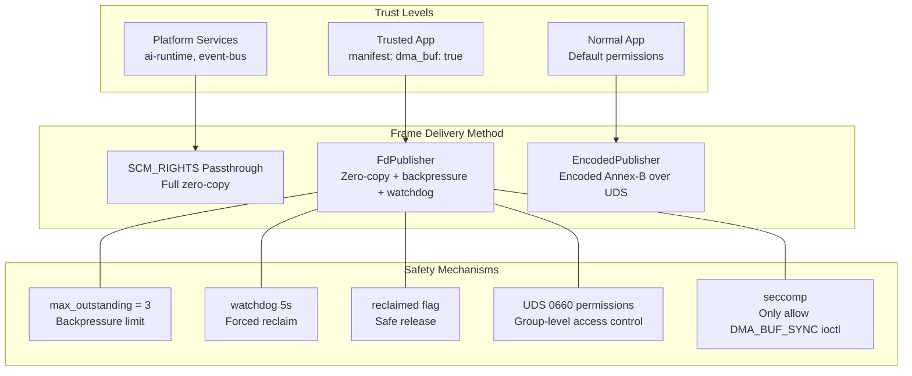

# Camera Daemon Design Document

## 1. Overview

Camera Daemon is the core C++ service of the AIPC platform, responsible for video capture, frame dispatch, encoding, and multi-channel frame publishing. It directly operates the HAL hardware abstraction layer, serving as the bridge between hardware and upper-layer platform services/App containers.

**Design Goals:**
- Zero-copy frame dispatch (DMA-BUF FD passthrough + reference counting)
- Dual-channel App delivery (FD passthrough / encoded-packet UDS coexistence)
- Strict buffer lifecycle management (reference counting + retain/release + watchdog)
- Platform-independent (HAL dynamic loading, no hardware coupling)
- Tiered container security isolation

## 2. Overall Architecture



## 3. Module Relationships and Initialization Order





## 4. Dual-Channel Frame Delivery

App containers can obtain video frames in two ways. The daemon automatically selects based on App permissions:

### 4.1 FD Passthrough (Zero-Copy) -- FdPublisher

**Applicable to:** Trusted Apps (manifest declares `dma_buf: true`)



**Wire Protocol (`fd_protocol.h`):**

| Direction | Message | Description |
|-----------|---------|-------------|
| Client -> Server | `SUBSCRIBE(stream_name)` | Subscribe to stream |
| Server -> Client | `FRAME` + SCM_RIGHTS | Frame metadata + DMA-BUF fd |
| Client -> Server | `RELEASE(frame_id)` | Return frame |
| Client -> Server | `UNSUBSCRIBE` | Unsubscribe |

**Security Constraints:**
- App container seccomp must allow `DMA_BUF_IOCTL_SYNC` (only this one ioctl)
- `max_outstanding_per_client = 3`, frames dropped if exceeded (backpressure protection)
- Watchdog 5s timeout forced reclaim (App crash/hang protection)

### 4.2 Encoded Packet Delivery -- EncodedPublisher

**Applicable to:** All Apps — raw H.264/H.265 Annex-B packets pushed over a Unix domain socket. This is the second delivery channel (besides FD passthrough) and carries *encoded* bitstream rather than raw frames.



**Wire Protocol (V2, 30-byte header):**

| Field | Size | Description |
|-------|------|-------------|
| `total_size` | 4B (LE) | Total size including header |
| `codec` | 1B | 0=h264, 1=h265 |
| `flags` | 1B | bit0 = keyframe |
| `timestamp_ns` | 8B (LE) | PTS |
| `width` | 4B (LE) | Video width |
| `height` | 4B (LE) | Video height |
| `dts_ns` | 8B (LE) | DTS |
| `data` | N bytes | Raw Annex-B bitstream |

**Notes:**
- Async dispatch: the encoder callback only enqueues (`MAX_QUEUE_SIZE = 120`) — it never blocks the encoder thread.
- Keyframe detection parses the Annex-B bitstream (H.264 IDR type 5 / H.265 IRAP types 16-23); clients can request a keyframe via a control message.
- The legacy `include/shm_protocol.h` describes a proposed SHM ring-buffer channel that was never wired into the daemon.

### 4.3 Comparison of the Two Delivery Channels

| | FD Passthrough | EncodedPublisher |
|---|---|---|
| Data | Raw NV12 DMA-BUF frames | H.264/H.265 Annex-B packets |
| Copy | 0 (fd + mmap) | 0 (packet broadcast) |
| Latency | ~0.03ms | Encoder-gated (encode then publish) |
| Container Permissions | seccomp: ioctl, SCM_RIGHTS | UDS connect |
| App Crash Risk | HAL buffer leak (watchdog protection) | None |
| Python Interface | recv_fd + mmap + np.frombuffer | recv + parse header |
| Recommended Use Case | AI inference, high-framerate analysis | Recording, streaming, post-processing |

## 5. Frame Lifecycle Management

### 5.1 Reference Counting Flow



### 5.2 Watchdog Forced Reclaim



## 6. Module Descriptions

### 6.1 HalLoader (`hal_loader.h/cpp`)

Dynamically loads HAL shared libraries via `dlopen`/`dlsym`.

| HAL | Symbol | Required |
|-----|--------|----------|
| Video | `HAL_VIDEO_OPS` | Required |
| Codec | `HAL_CODEC_OPS` | Optional |
| OSD | `HAL_OSD_OPS` | Optional |

### 6.2 VideoSource (`video_source.h/cpp`)

Wraps `hal_video.h` interface, push-mode frame callbacks, supports multi-stream (ISP hardware scaler).

**Key Point:** 4K main stream + 640x640 AI stream + sub-stream are all ISP hardware-scaled outputs, no software scaling.

### 6.3 FrameRouter (`frame_router.h/cpp`)

Reference-counted frame dispatch core.

```cpp
struct ManagedFrame {
    HalRawFrame     frame;           // Shallow copy (dma_fd and other metadata)
    std::atomic<int> ref_count{0};   // Initial = subscriber count
    std::atomic<bool> reclaimed{false}; // Watchdog forced reclaim flag
    uint64_t        frame_id;
};
```

The `retain()` method is used by FdPublisher to increment the reference count per client when dispatching to N clients, extending the frame's lifetime until all clients have RELEASE'd.

`force_reclaim()` safety mechanism: On watchdog timeout, marks `reclaimed = true` and immediately releases the frame to HAL, but does not delete the ManagedFrame (FD clients may still hold references). Subsequent `release()` calls check the `reclaimed` flag and skip HAL release, deleting the object when ref_count finally drops to 0.

### 6.4 FrameWatchdog (`frame_watchdog.h/cpp`)

| Parameter | Default | Description |
|-----------|---------|-------------|
| `scan_interval_ms` | 100ms | Scan period |
| `frame_timeout_ms` | 5000ms | Timeout forced reclaim |
| `warn_threshold_ms` | 3000ms | Warning threshold |

> Values match `watchdog:` in `configs/platform/camera-daemon.yaml`.

### 6.5 FdPublisher (`fd_publisher.h/cpp`)

Zero-copy DMA-BUF FD publisher.

**Thread Model:**
- 1 accept thread (listening on UDS)
- N recv threads (one per client, handling SUBSCRIBE/RELEASE)
- Frame dispatch on FrameRouter callback thread (non-blocking sendmsg)

**Frame Dispatch Flow:**
```
on_frame(stream, mf):  // FrameRouter callback
  for each subscribed client:
    if outstanding >= max_outstanding -> drop
    retain(mf)            // +1 ref
    sendmsg(SCM_RIGHTS)   // send dma_fd
    track in outstanding
  release(mf)             // release this callback's ref
```

**Client Disconnect Handling:** Release all outstanding frame references for the disconnected client. If a frame has already been reclaimed by the watchdog, release checks the `reclaimed` flag and safely skips HAL release.

### 6.6 Frame Delivery

All frame delivery is FD passthrough via `FdPublisher` (section 6.5) using
`SCM_RIGHTS` over a Unix domain socket — there is no SHM publisher. The
`include/shm_protocol.h` header describing a legacy SHM ring-buffer layout
(`SHM_MAGIC 'AIPC'`, `ShmSlotHeader`, etc.) still exists in-tree but is **not
referenced by any source file** (dead code) and has no runtime counterpart.

### 6.7 OsdManager (`osd_manager.h/cpp`)

Manages per-stream OSD instances (independent instances for different resolutions). `draw()` performs in-place pixel modification on `HalRawFrame`, used only for the encoding path and does not affect the AI inference stream.

### 6.8 EncoderManager (`encoder_manager.h/cpp`)

Manages HAL Codec hardware encoder instances. Uses push mode (`subscribe`) to obtain encoded packets. `encode_frame` accepts `HalRawFrame*`, and HAL internally accesses DMA-BUF directly for zero-copy encoding. Supports runtime parameter adjustment (bitrate, framerate, GOP, force keyframe).

## 7. Data Flow Overview



## 8. Typical App-Side Usage

### 8.1 AI Inference (FD Passthrough, Python)

```python
from hailo_ipc_sdk import FrameReceiver

receiver = FrameReceiver("/run/aipc/camera.sock", stream="ai")

with receiver.recv_frame() as frame:
    # frame.array: numpy view on mmap'd DMA-BUF, zero-copy
    # 640x640 NV12, ISP hardware-scaled output
    results = hailo_infer(frame.array)
    # Exiting the with block auto munmap + RELEASE
```

### 8.2 Encoded Stream Consumption (UDS, Python)

```python
import socket, struct

sock = socket.socket(socket.AF_UNIX, socket.SOCK_STREAM)
sock.connect("/run/aipc/encoded/main.sock")

def recv_exact(fd, n):
    buf = b""
    while len(buf) < n:
        chunk = fd.recv(n - len(buf))
        if not chunk:
            raise EOFError
        buf += chunk
    return buf

while True:
    header = recv_exact(sock, 30)
    (total_size, codec, flags, ts_ns, width, height, dts_ns) = \
        struct.unpack("<IBBQIIQ", header)
    data = recv_exact(sock, total_size - 30)
    # data is a raw H.264/H.265 Annex-B NAL stream; flags & 0x1 = keyframe
    handle_packet(data, keyframe=(flags & 1))
```

### 8.3 ROI Crop Analysis (FD Passthrough, Python)

```python
with receiver.recv_frame() as frame:
    h, w = frame.height, frame.width
    y_plane = frame.array[:h*w].reshape(h, w)
    roi = y_plane[100:300, 200:400]  # Zero-copy view crop
    analyze(roi)
```

## 9. Build

```bash
cd platform/camera-daemon
mkdir -p build && cd build
cmake ..
make -j$(nproc)
```

**Dependencies:** C++17, libdl, libpthread, librt. No GStreamer.

## 10. Configuration

```yaml
hal:
  video_library: /data/aipc/lib/hal/libaipc_hal.so
  codec_library: /data/aipc/lib/hal/libaipc_hal.so
  lens_library: /data/aipc/lib/hal/libhal-lens-bridge.so

video:
  device_path: /dev/video0

watchdog:
  scan_interval_ms: 100
  frame_timeout_ms: 5000
  warn_threshold_ms: 3000

rtsp:
  enabled: true

encoders:
  - stream_name: main
    codec: h264
    width: 1920
    height: 1080
    fps: 30
    enabled: true
  - stream_name: sub
    codec: h264
    width: 1280
    height: 720
    fps: 30
    enabled: true
  - stream_name: third
    codec: h264
    width: 640
    height: 384
    fps: 15
    enabled: true
```

> `encoders` is the single source of truth for stream configs — the legacy
> `video.streams` section was removed. There is no `shm:` or `fd_publisher:`
> YAML section; the FD publisher socket (`/run/aipc/camera.sock`, 16 max
> clients) is hardcoded in `src/main.cpp`. Full config:
> `configs/platform/camera-daemon.yaml`.

## 11. File Listing

```
platform/camera-daemon/
├── CMakeLists.txt
├── include/
│   ├── camera_daemon.h      # Top-level orchestrator + config structs
│   ├── hal_loader.h          # HAL dynamic loading
│   ├── video_source.h        # HAL Video wrapper
│   ├── frame_router.h        # Reference-counted frame dispatch (retain/release/reclaimed)
│   ├── frame_watchdog.h      # Timeout forced reclaim
│   ├── fd_protocol.h         # FD passthrough wire protocol (SCM_RIGHTS)
│   ├── fd_publisher.h        # FD passthrough publisher
│   ├── shm_protocol.h        # Legacy SHM ring buffer layout (unused/dead)
│   ├── encoded_publisher.h   # Encoded packet UDS publisher
│   ├── osd_manager.h         # OSD management
│   └── encoder_manager.h     # Hardware encoding management
├── src/
│   ├── main.cpp              # Entry, config, signal handling
│   ├── camera_daemon.cpp     # Orchestrator
│   ├── hal_loader.cpp
│   ├── video_source.cpp
│   ├── frame_router.cpp
│   ├── frame_watchdog.cpp
│   ├── fd_publisher.cpp
│   ├── encoded_publisher.cpp
│   ├── osd_manager.cpp
│   └── encoder_manager.cpp
```

## 12. Security Model



| App Type | Frame Delivery Method | Container Permissions | Risk Control |
|----------|----------------------|----------------------|-------------|
| Trusted App (`dma_buf: true`) | FD passthrough | seccomp: +ioctl(DMA_BUF_SYNC) | Watchdog + backpressure |
| Normal App (default) | EncodedPublisher (UDS) | UDS connect | N/A (encoded packets only) |
| Platform Service (ai-runtime) | SCM_RIGHTS passthrough | Full trust | N/A |
