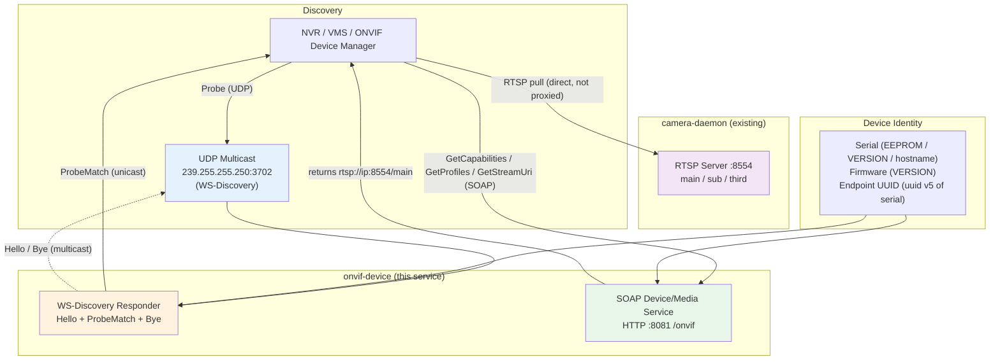
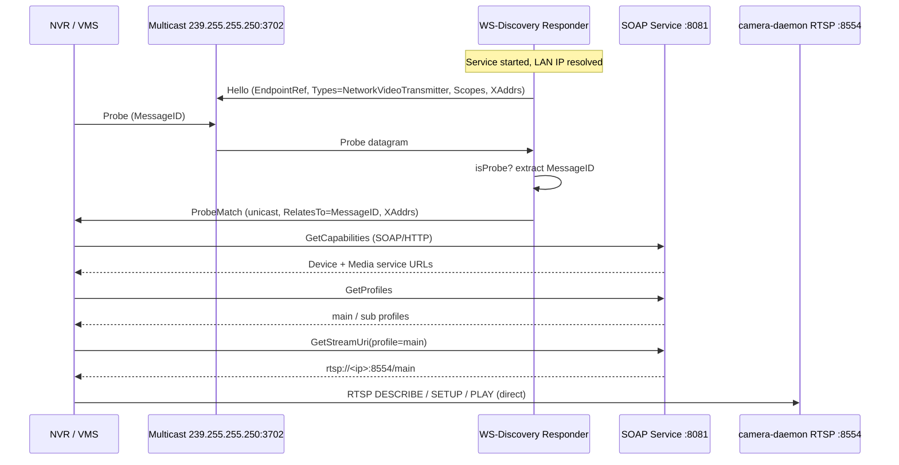
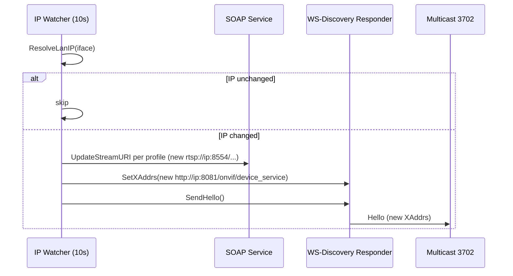
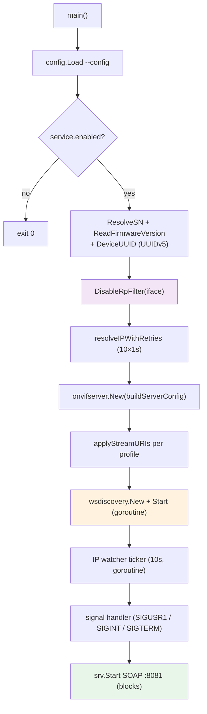

# ONVIF Device Service

## Overview

`onvif-device` exposes the NE503 AIPC as a standard **ONVIF Profile S** network
camera so that third-party NVR/VMS software (Milestone, Blue Iris, Hikvision/Dahua
NVRs, iVMS, Shinobi, ONVIF Device Manager) can discover it on the LAN and pull its
RTSP stream with **no vendor-specific integration**.

It is a thin **signalling** service. It answers WS-Discovery (UDP multicast) so
clients can find it, and serves the ONVIF Device + Media SOAP services over HTTP.
`GetStreamUri` hands out the RTSP URIs served by `camera-daemon`
(`rtsp://<device-ip>:8554/<stream>`) — video **never flows through** this process.

> Coexists with `device-discovery` (CT-Disc on `239.255.255.250:19850`). ONVIF
> uses the standard WS-Discovery group `239.255.255.250:3702` — a different port
> and a different set of consumers. The two services do not interfere.

## Directory Structure

```
platform/onvif-device/
├── server/main.go            # Entry point: config, identity, IP watcher, signals
├── config/config.go          # /data/aipc/etc/onvif.yaml loader + built-in defaults
├── identity/identity.go      # Serial/firmware/UUID resolution + rp_filter + LAN IP
└── wsdiscovery/responder.go  # UDP 3702 Hello / ProbeMatch / Bye responder
```

The SOAP Device/Media service is provided by the
[`github.com/0x524a/onvif-go`](https://github.com/0x524a/onvif-go) `server`
package. **WS-Discovery is hand-written** — that library ships a discovery client
only, so the server-side Hello/ProbeMatch/Bye responder in `wsdiscovery/` mirrors
its `Probe` template.

## System Architecture



**Key point:** ONVIF only does signalling (returns the RTSP URI and device/profile
metadata). The video stream is pulled directly from `camera-daemon`'s existing
RTSP server — zero extra media overhead.

## WS-Discovery Interaction Flow

### Power-on discovery (Hello + Probe)



### IP change / DHCP renewal



`SIGUSR1` forces a re-announce regardless of IP change. `SIGINT`/`SIGTERM` sends
a `Bye` and exits.

## ONVIF Services (Phase 1)

| ONVIF Service | Status | Backed by |
|---------------|--------|-----------|
| **Device** (`GetDeviceInformation`, `GetCapabilities`, `GetScopes`, `GetHostname`, `GetSystemDateAndTime`) | ✅ Phase 1 | Config + device identity (serial/firmware from EEPROM/VERSION) |
| **Media** (`GetProfiles`, `GetStreamUri`, `GetVideoEncoderConfigurations`) | ✅ Phase 1 | Configured profiles → `camera-daemon` RTSP URIs |
| Imaging (`GetImagingSettings`, `SetImagingSettings`, focus `Move`) | ⏳ Phase 2 | ISP settings + device-control lens Focus |
| PTZ (`ContinuousMove`, `Stop`, `AbsoluteMove`) — zoom axis only | ⏳ Phase 3 | device-control lens `ZoomRun` / `ZoomAbs` / `ZoomStop` |
| Events (motion / AI detection) | ⏳ Phase 4 | event-bus |

Profile S (Streaming) is the minimum NVR requirement and is fully covered in
Phase 1.

### Media profiles → RTSP streams

Each config profile maps to one `camera-daemon` RTSP path. The advertised URI is
`rtsp://<device-ip>:<rtsp.port>/<stream>`:

| Profile token | RTSP path | Default resolution | Codec |
|---------------|-----------|--------------------|-------|
| `main` | `/main` | 1920×1080 @30fps | H.264 |
| `sub` | `/sub` | 1280×720 @30fps | H.264 |

> The SOAP server binds `0.0.0.0` but advertises the **real device LAN IP** in
> stream URIs and XAddrs (via the library's `UpdateStreamURI` at runtime, which
> takes precedence over its localhost default).

## Authentication

ONVIF uses WS-Security UsernameToken (digest). The SOAP layer enforces digest auth
**only when both username and password are set** (all-or-nothing in the library).

| Mode | Behaviour |
|------|-----------|
| `none` (default) | No auth — best NVR-onboarding interop; relies on the LAN trust boundary |
| `digest` | WS-Security digest; prefers `AIPC_AUTH_USERNAME` / `AIPC_AUTH_PASSWORD` (shared with `platform-api`), falls back to the config values, and disables auth with a warning if neither is set |

Default is `none` because some NVRs probe `GetSystemDateAndTime`/`GetCapabilities`
unauthenticated during onboarding and would fail to add the device otherwise.

## Configuration

File: `configs/platform/onvif.yaml` → deployed to `/data/aipc/etc/onvif.yaml`.
Every field has a built-in default, so the service runs correctly before the file
exists.

```yaml
service:
  enabled: true
  http_port: 8081            # SOAP Device/Media port
  base_path: /onvif          # /onvif/device_service, /onvif/media_service
  log_level: info

network:
  interface: eth0            # LAN interface for multicast + IP discovery
  multicast_addr: 239.255.255.250  # WS-Discovery group (standard, fixed)
  multicast_port: 3702       # WS-Discovery port (standard, fixed; ≠ CT-Disc 19850)

device:
  manufacturer: CamThink
  model: NE503
  hardware_id: NE503
  serial_number: ""          # blank → EEPROM → VERSION "serial=" → hostname
  firmware_version: ""       # blank → VERSION "version="
  scopes:
    - onvif://www.onvif.org/Profile/Streaming   # Profile S (required for NVR)
    - onvif://www.onvif.org/Profile/T
    - onvif://www.onvif.org/name/CamThink/NE503

rtsp:
  port: 8554                 # camera-daemon RTSP server port

profiles:
  - { token: main, name: Main Stream, stream: main, width: 1920, height: 1080, fps: 30, codec: H264, bitrate: 4096 }
  - { token: sub,  name: Sub Stream,  stream: sub,  width: 1280, height: 720,  fps: 30, codec: H264, bitrate: 2048 }

auth:
  mode: none                 # none | digest
  username: ""
  password: ""

version_file: ""             # default /data/aipc/VERSION
```

### Device identity resolution

`serial_number` is resolved in priority order:

1. Config `device.serial_number` override
2. Factory EEPROM (`platform/common/factoryeeprom`)
3. `version_file` line `serial=`
4. Hostname (last resort)

`firmware_version`: config override → `version_file` `version=` → `unknown`.

The WS-Discovery endpoint reference is a stable **UUIDv5** derived from the serial
(`uuid.NewSHA1(NameSpaceDNS, serial)`), so it is deterministic across reboots.

### Multicast + rp_filter

WS-Discovery responses originate from the device's unicast IP but are destined for
a multicast group. Linux drops these when `rp_filter=1` (the default). The service
sets `rp_filter=0` for the configured interface (in-memory + a persisted
`/etc/sysctl.d/99-onvif-rp_filter.conf`), mirroring the pattern already used by
`device-discovery`.

## Build

```bash
make onvif-device   # build just this service → build/onvif-device
make platform       # build all platform services (now includes onvif-device)
```

### Startup flow



## Interop Testing

These are the acceptance criteria for Phase 1 (network discovery cannot be
unit-tested — it is validated end-to-end):

```bash
# 1. Discover the device on the LAN (WS-Discovery Probe)
#    Linux: wsdiscovery / onvif-cli ; Windows: ONVIF Device Manager GUI
onvif-cli discover

# 2. SOAP round-trip
onvif-cli --host <device-ip>:8081 --onvif-path /onvif get-device-information
onvif-cli ... get-stream-uri --profile-token main
#   → rtsp://<device-ip>:8554/main

# 3. Pull the stream the NVR would receive
ffplay rtsp://<device-ip>:8554/main

# 4. Real NVR (Hikvision/Dahua/Milestone): Add Device → auto-discover → preview
```

### Unit tests

```bash
go test -race -cover ./platform/onvif-device/...
```

Deterministic logic (config parsing, identity resolution, SOAP/WS-Discovery
message construction, auth resolution, server-config mapping) is unit-tested.
The entrypoint, IP-retry loop, and multicast socket I/O are covered by the
interop tests above.

## Systemd Unit

Unit file: `systemd/onvif-device.service`. Runs after `camera-daemon.service`
(stream URIs must point at a live RTSP server). `Restart=always`. See
[`../references/systemd-services.md`](../references/systemd-services.md).

```bash
sudo systemctl enable --now onvif-device
journalctl -u onvif-device -f
```

## Roadmap

| Phase | Scope | Status |
|-------|-------|--------|
| 1 | Profile S — discovery + Device + Media (`GetStreamUri`) | ✅ Delivered |
| 2 | Imaging — ISP settings + focus (device-control lens) | Planned |
| 3 | PTZ — zoom axis only (`Vector1D`, no pan/tilt) | Planned |
| 4 | Events — motion / AI detection via event-bus | Optional |

> Phases 2–3 require the library's Imaging/PTZ handlers to call back into the
> hardware gRPC (they currently use internal simulator state). This will need a
> thin SOAP-layer extension or vendoring at that point; Phase 1 (Device/Media) is
> config-driven and needs none of it.
